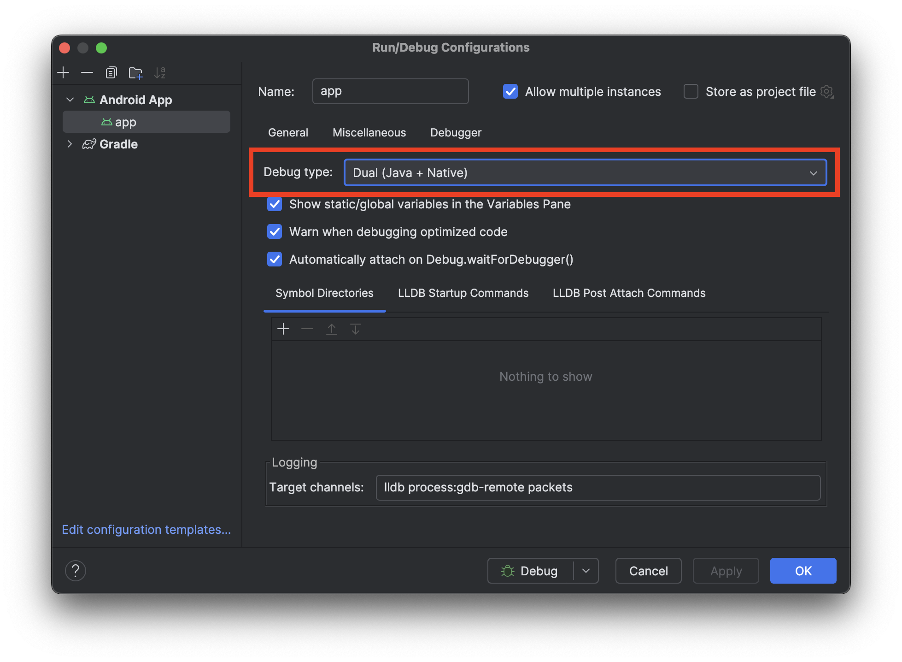
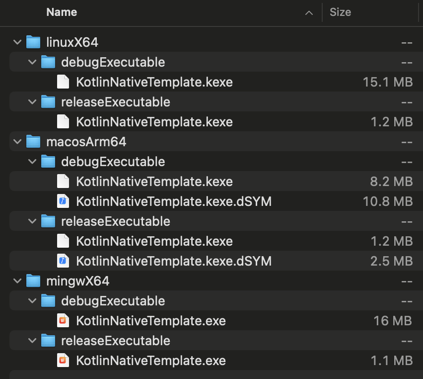

# Cross-compilation tips

## Linux cross-compilation on Windows or macOS

If this is your first time cross-compiling a Linux binary on macOS, you may encounter a linker
error reporting that the linker has received some unknown command-line arguments. That happens
because you tried to link a Linux binary using the linker for Apple platforms.

```
error linking with `cc` failed: exit status 1
  |
  = note: LC_ALL="C" PATH="..." "<linker path>" <arguments ...>
  = note: ld: unknown options: --version-script=... --no-undefined-version ...
          clang: error: linker command failed with exit code 1 (use -v to see invocation)
```

Similarly, if you try to cross-compile a Linux binary on Windows, you may encounter a different
error by Cargo that it couldn't find `cc`.

```
error: linker `cc` not found
  |
  = note: program not found
```

### Install Zig

When you want to build your application or library for Linux on Windows or macOS, you have to use a
dedicated cross-compilation linker for Linux. There are two available options: GCC and Zig. The
latter is much easier to install.

You can manually download Zig [here](https://ziglang.org/download/). If you're using a package
manager, you can also install Zig as follows:

| Package Manager      | Command                          | Zig Installation Path                                                   |
|----------------------|----------------------------------|-------------------------------------------------------------------------|
| WinGet (Windows)     | `winget install -e --id zig.zig` | `%LOCALAPPDATA%\Microsoft\WinGet\Links\zig.exe`                         |
| Chocolatey (Windows) | `choco install zig`              | `C:\ProgramData\chocolatey\bin\zig.exe`                                 |
| Homebrew (macOS)     | `brew install zig`               | `/opt/homebrew/bin/zig` (Apple Silicon) or `/usr/local/bin/zig` (Intel) |

Next, we have to make Cargo use Zig when building libraries for Linux. First, find where `zig` is
installed. If you installed Zig using a package manager, the installation path is mentioned above.
Make sure Zig is installed correctly.

On Windows using PowerShell:

```
> & "${env:LOCALAPPDATA}\Microsoft\WinGet\Links\zig.exe" version
0.13.0
> C:\ProgramData\chocolatey\bin\zig.exe version
0.13.0
```

or CMD:

```
> %LOCALAPPDATA%\Microsoft\WinGet\Links\zig.exe version
0.13.0
```

On macOS:

```
> /opt/homebrew/bin/zig version
0.13.0
```

### Make Cargo use Zig (Windows)

We make two batch scripts that uses the `zig` command. You can use any name, but we'll use the
following names.

> `%USERPROFILE` is `C:\Users\<user name>`.

- `%USERPROFILE%\.cargo\x86_64-unknown-linux-gnu-cc.bat`
- `%USERPROFILE%\.cargo\aarch64-unknown-linux-gnu-cc.bat`

In `x86_64-unknown-linux-gnu-cc.bat`, put the following:

```batch
@echo off
<zig path> cc -target x86_64-linux-gnu %*
```

If you installed Zig with WinGet, the content is:

```batch
@echo off
%LOCALAPPDATA%\Microsoft\WinGet\Links\zig.exe cc -target x86_64-linux-gnu %*
```

Similarly, in `aarch64-unknown-linux-gnu-cc.bat`, put as follows:

```batch
@echo off
<zig path> cc -target aarch64-linux-gnu %*
```

This is the final step. Put the paths to the script files in
[the Cargo configuration file](https://doc.rust-lang.org/cargo/reference/config.html). The easiest
option is to modify `%USERPROFILE%\.cargo\config.toml` as follows.

```toml
[target.x86_64-unknown-linux-gnu]
linker = "C:\\Users\\<user name>\\.cargo\\x86_64-unknown-linux-gnu-cc.bat"

[target.aarch64-unknown-linux-gnu]
linker = "C:\\Users\\<user name>\\.cargo\\aarch64-unknown-linux-gnu-cc.bat"
```

You're ready to start building your library and application for Linux.

### Make Cargo use Zig (macOS)

We make two shell scripts that uses the `zig` command. You can use any name, but we'll use the
following names.

- `~/.cargo/x86_64-unknown-linux-gnu-cc.sh`
- `~/.cargo/aarch64-unknown-linux-gnu-cc.sh`

In `x86_64-unknown-linux-gnu-cc.sh`, put the following:

```shell
#! /bin/sh
<zig path> cc -target x86_64-linux-gnu "$@"
```

If you installed Zig with Homebrew on a Apple Silicon Mac, the content is:

```shell
#! /bin/sh
/opt/homebrew/bin/zig -target x86_64-linux-gnu "$@"
```

Similarly, in `aarch64-unknown-linux-gnu-cc.sh`, put as follows:

```shell
#! /bin/sh
<zig path> cc -target aarch64-linux-gnu "$@"
```

After making two script files, ensure that these files are executable.

```
chmod 555 ~/.cargo/x86_64-unknown-linux-gnu-cc.sh
chmod 555 ~/.cargo/aarch64-unknown-linux-gnu-cc.sh
```

This is the final step. Put the paths to the script files in
[the Cargo configuration file](https://doc.rust-lang.org/cargo/reference/config.html). The easiest
option is to modify `~/.cargo/config.toml` as follows.

```toml
[target.x86_64-unknown-linux-gnu]
linker = "/Users/<user name>/.cargo/x86_64-unknown-linux-gnu-cc.sh"

[target.aarch64-unknown-linux-gnu]
linker = "/Users/<user name>/.cargo/aarch64-unknown-linux-gnu-cc.sh"
```

You're ready to start building your library and application for Linux.

## LLVM version compatibility on Apple Platforms

If you encounter an undefined symbols linker error like the following when building your Rust
library that has a dependency on a C library for iOS, you may have an LLVM version compatibility
issue.

```
Undefined symbols for architecture arm64:
  "___chkstk_darwin", referenced from:
      <function name> in <library file name or object file name>
ld: symbol(s) not found for architecture arm64
clang: error: linker command failed with exit code 1 (use -v to see invocation)
```

To check your Rust toolchain's LLVM version, use `rustc --version --verbose`. For example,

```
> rustc --version --verbose
rustc 1.82.0 (f6e511eec 2024-10-15)
binary: rustc
commit-hash: f6e511eec7342f59a25f7c0534f1dbea00d01b14
commit-date: 2024-10-15
host: aarch64-apple-darwin
release: 1.82.0
LLVM version: 19.1.1
```

You can see that Rust 1.82 uses LLVM 19. To check the LLVM version used by Xcode, use
`/usr/bin/gcc --version` (Yeah, Apple puts Clang in that path.)

```
> /usr/bin/xcodebuild -version
Xcode 16.2
Build version 16C5032a
> /usr/bin/gcc --version
Apple clang version 16.0.0 (clang-1600.0.26.6)
Target: arm64-apple-darwin24.3.0
Thread model: posix
InstalledDir: /Applications/Xcode.app/Contents/Developer/Toolchains/XcodeDefault.xctoolchain/usr/bin
```

You can see Xcode 16.2 uses LLVM 16. So, the linker in Apple LLVM 16 tried to link object files that
targets LLVM 19, which resulted in a linker error.

To resolve this issue, try downgrading your Rust toolchain to a version that uses lower LLVM
version. For example, Rust 1.81 uses LLVM 18, so downgrading to 1.81 might help.

```
> rustup target add 1.81
> rustup default 1.81
> rustc --version --verbose
rustc 1.81.0 (eeb90cda1 2024-09-04)
binary: rustc
commit-hash: eeb90cda1969383f56a2637cbd3037bdf598841c
commit-date: 2024-09-04
host: aarch64-apple-darwin
release: 1.81.0
LLVM version: 18.1.7
```

You can also set the toolchain directory via the `toolchainDirectory` property in the `rust {}`
block, so consider using this if you don't want to `rustup default 1.81`.

To see which Rust version uses which LLVM version, see the Rust
compiler [CHANGELOG](https://github.com/rust-lang/rust/blob/master/RELEASES.md#version-1820-2024-10-17).
You can see LLVM version upgrade notes in `Internal Changes` sections.

## C++ Runtime on Android NDK

Android NDK has multiple kinds of C++ runtime libraries, so it is important to check which one you
are using now. If you encounter a linker error (whether it's dynamic or static) mentioning functions
like `__cxa_pure_virtual`, you may have not linked C++ runtime to your library properly.

Such error can be a dynamic library load error in runtime like the following:

```
dlopen failed: cannot locate symbol "__cxa_pure_virtual" referenced by "/data/app/.../libyourlibrary.so"
```

or a linking error occurred during build as below.

```
<file name>: undefined reference to `__cxa_pure_virtual'
```

Currently, two C++ runtime libraries are available: `libc++_static.a` and `libc++_shared.so`. The
criteria for choosing which one to use is explained in detail in
[the official documentation](https://developer.android.com/ndk/guides/cpp-support#ic). If you are
embedding your Rust library to an application, use `libc++_shared.so`.

To link C++ runtime, use
Cargo [build scripts](https://doc.rust-lang.org/cargo/reference/build-scripts.html).
Configure the path to the directory containing the runtime libraries via the
`cargo::rustc-link-search` command. Use `cargo::rustc-link-lib` to control which runtime library to
link. For example in `<manifest dir>/build.rs`:

```rust
use std::env;
use std::path::PathBuf;

fn main() {
    // The ANDROID_NDK_ROOT variable is automatically set to <SDK root>/ndk/<NDK version> by the
    // Cargo Gradle plugin. You may want to implement your own logic finding the path to NDK if
    // you are not invoking Cargo from Gradle.
    let android_ndk_root = env::var("ANDROID_NDK_ROOT").unwrap();

    // set this to false if you want to use libc++_static.a.
    let use_shared = true;

    let host = if cfg!(target_os = "windows") {
        "windows-x86_64"
    } else if cfg!(target_os = "macos") {
        // Apple Sillion Macs also use x86_64.
        "darwin-x86_64"
    } else if cfg!(target_os = "linux") {
        "linux-x86_64"
    } else {
        panic!("unsupported host")
    };

    let ndk_triplet = match env::var("CARGO_CFG_TARGET_ARCH").unwrap().as_str() {
        "aarch64" => "aarch64-linux-android",
        "arm" => "arm-linux-androideabi",
        "x86_64" => "x86_64-linux-android",
        "x86" => "i686-linux-android",
        /* RISC-V is not supported by this project yet */
        _ => panic!("unsupported architecture"),
    };

    // `libc++_shared.so` and `libc++_static.a` are in
    // toolchains/llvm/prebuilt/<host>/sysroot/usr/lib/<NDK triplet>.
    let library_dir = PathBuf::from(android_ndk_root)
        .join("toolchains")
        .join("llvm")
        .join("prebuilt")
        .join(host)
        .join("sysroot")
        .join("usr")
        .join("lib")
        .join(ndk_triplet);

    // Configure the library directory path.
    println!("cargo::rustc-link-search={}", library_dir.display());

    // Configure the library name.
    println!(
        "cargo::rustc-link-lib={}={}",
        if use_shared { "dylib" } else { "static" },
        if use_shared { "c++_shared" } else { "c++_static" },
    );
}
```

Some Rust libraries automatically find `libc++_static.a` or `libc++_shared.so` from NDK, and they
usually allow users to control this using Cargo features. If some of your dependency uses
`libc++_static.a` while others use `libc++_shared.so`, you may encounter another linker error like
the following.

```
ld: error: <HOME>/.rustup/toolchains/.../lib/rustlib/armv7-linux-androideabi/lib/libcompiler_builtins-...(compiler_builtins-... .o): symbol __aeabi_memcpy8@@LIBC_N has undefined version LIBC_N
```

Before such error is printed, Cargo shows the entire linker invocation arguments. For example, you
may be able to see something like:

```
error: linking with `<linker path>` failed: exit status: 1
  |
  = note: LC_ALL="C" PATH="..." "<linker path>" <arguments ...>
```

Copy this error and see if both `-lc++_static` and `-lc++_shared` are in the invocation. If this is
the case, inspect the output emitted by build scripts of dependencies. You can read it from
`target[/<Cargo triplet>]/<profile>/build/<package name>-<hash>/output`. For example in
`target/aarch64-linux-android/debug/build/blake3-<hash>/output`, you can see something like the
following.

```
cargo:rerun-if-env-changed=CARGO_FEATURE_PURE
cargo:rerun-if-env-changed=CARGO_FEATURE_NO_NEON
cargo:rerun-if-env-changed=CARGO_FEATURE_NEON
cargo:rerun-if-env-changed=CARGO_FEATURE_NEON
cargo:rerun-if-env-changed=CARGO_FEATURE_NO_NEON
cargo:rerun-if-env-changed=CARGO_FEATURE_PURE
cargo:rustc-cfg=blake3_neon
TARGET = Some("aarch64-linux-android")
OPT_LEVEL = Some("0")
HOST = Some("aarch64-apple-darwin")
...
```

Check whether there is something like `cargo::rustc-link-lib=c++_static` in it.

When you use `libc++_shared.so`, it should be embedded into the application. Use the
`dynamicLibraries` property in the `builds.android {}` block to ensure `libc++_shared.so` is
included in the resulting Android application/library.

```
cargo {
    builds.android {
        dynamicLibraries.addAll("c++_shared")
    }
}
```

## Supporting 16 KB page sizes on Android

> :bulb: We recommend to first read
> the [official documentation](https://developer.android.com/guide/practices/page-sizes).

> :warning: If you're using UniFFI, you also have to upgrade JNA to 5.17 or higher. Please
> see [How to upgrade the JNA version](#how-to-upgrade-the-jna-version) for
> details.

Starting from Android 15, AOSP allows devices to use a page size of 16 KB. You should configure
the linker to use a 16 KB page size to properly handle this. If you're using NDK r28 or higher,
NDK will handle this automatically.

### How to check the NDK version

You can get the NDK version you're using via `android.ndkVersion`.

```kotlin
println("ndkVersion: ${android.ndkVersion}")
```

```
> Configure project :your-project
ndkVersion: 27.0.12077973
```

If the above code reports NDK r27 or lower, you can set the NDK version using the same property.

```kotlin
android {
    ndkVersion = "28.0.13004108"
}
```

### Manually configuring the page size

If you're not able to upgrade the NDK version, you have two options to configure the page size
manually.

#### Using Gradle DSL

Pass `-C link-args=-Wl,-z,max-page-size=16384` to `RUSTFLAGS`.

```kotlin
cargo {
    builds.android {
        variants {
            buildTaskProvider.configure {
                additionalEnvironment.put(
                    "RUSTFLAGS",
                    "-C link-args=-Wl,-z,max-page-size=16384",
                )
            }
        }
    }
}
```

#### Using Cargo Configuration

You can also modify `RUSTFLAGS`
in [Cargo Configuration](https://doc.rust-lang.org/cargo/reference/config.html). Putting
`rustflags = ["-C", "link-args=-Wl,-z,max-page-size=16384"]` has the same effect as the Gradle
DSL described above. For example in `%USERPROFILE%\.cargo\config.toml` (Windows) or
`~/.cargo/config.toml` (macOS & Linux), you can configure this as follows:

```toml
[target.aarch64-linux-android]
rustflags = ["-C", "link-args=-Wl,-z,max-page-size=16384"]

[target.armv7-linux-androideabi]
rustflags = ["-C", "link-args=-Wl,-z,max-page-size=16384"]

[target.x86_64-linux-android]
rustflags = ["-C", "link-args=-Wl,-z,max-page-size=16384"]

[target.i686-linux-android]
rustflags = ["-C", "link-args=-Wl,-z,max-page-size=16384"]
```

### How to check the page size of the dynamic library

To check whether the Rust library is built with a 16 KB page size, you can use the `llvm-readelf`
command in NDK.

```shell
<Android SDK Root>/ndk/<NDK version>/toolchains/llvm/prebuilt/<Host Triplet>/bin/llvm-readelf -l target/<target triplet>/<profile>/libyour_project.so
```

For example,

```shell
# On Windows, checking a AArch64 Android dynamic library
<NDK Root>\toolchains\llvm\prebuilt\windows-x86_64\bin\llvm-readelf.exe -l target\aarch64-linux-android\debug\libyour_project.so

# On macOS, checking a Arm32 Android dynamic library
# Apple Silicon Macs also use darwin-x86_64
<NDK Root>/toolchains/llvm/prebuilt/darwin-x86_64/bin/llvm-readelf -l target/armv7-linux-androideabi/debug/libyour_project.so

# On Linux
<NDK Root>/toolchains/llvm/prebuilt/linux-x86_64/bin/llvm-readelf -l target/armv7-linux-androideabi/debug/libyour_project.so
```

When you run the command, you can see something like this.

```
Elf file type is DYN (Shared object file)
Entry point 0x0
There are 10 program headers, starting at offset 64

Program Headers:
  Type           Offset   VirtAddr           PhysAddr           FileSiz  MemSiz   Flg Align
  PHDR           0x000040 0x0000000000000040 0x0000000000000040 0x000230 0x000230 R   0x8
  LOAD           0x000000 0x0000000000000000 0x0000000000000000 0x018d28 0x018d28 R   0x4000
  LOAD           0x018d28 0x000000000001cd28 0x000000000001cd28 0x0306c8 0x0306c8 R E 0x4000
  LOAD           0x0493f0 0x00000000000513f0 0x00000000000513f0 0x001e08 0x002c10 RW  0x4000
  LOAD           0x04b1f8 0x00000000000571f8 0x00000000000571f8 0x000078 0x0009a0 RW  0x4000
  DYNAMIC        0x04ae40 0x0000000000052e40 0x0000000000052e40 0x000190 0x000190 RW  0x8
  GNU_RELRO      0x0493f0 0x00000000000513f0 0x00000000000513f0 0x001e08 0x002c10 R   0x1
  GNU_EH_FRAME   0x00bd6c 0x000000000000bd6c 0x000000000000bd6c 0x00234c 0x00234c R   0x4
  GNU_STACK      0x000000 0x0000000000000000 0x0000000000000000 0x000000 0x000000 RW  0x0
  NOTE           0x000270 0x0000000000000270 0x0000000000000270 0x000098 0x000098 R   0x4

 Section to Segment mapping:
  Segment Sections...
   00     
   01     .note.android.ident .dynsym .gnu.version .gnu.version_r .gnu.hash .hash .dynstr .rela.dyn .rela.plt .rodata .gcc_except_table .eh_frame_hdr .eh_frame 
   02     .text .plt 
   03     .data.rel.ro .fini_array .dynamic .got .got.plt .relro_padding 
   04     .data .bss 
   05     .dynamic 
   06     .data.rel.ro .fini_array .dynamic .got .got.plt .relro_padding 
   07     .eh_frame_hdr 
   08     
   09     .note.android.ident 
   None   .comment .debug_abbrev .debug_info .debug_aranges .debug_ranges .debug_str .debug_line .debug_loc .symtab .shstrtab .strtab
```

Look at the program headers named `LOAD`.

```
LOAD           0x000000 0x0000000000000000 0x0000000000000000 0x018d28 0x018d28 R   0x4000
```

If the page size is configured correctly, you would be able to see the `Align` column has a value
of `0x4000` (16384), which means that the dynamic library is built with a page size of 16 KB.

If this value is `0x1000` (4096), that means the linker used a 4 KB page size. Check the NDK version
or `RUSTFLAGS` again if you encountered this problem.

### How to upgrade the JNA version

> Please refer
> to [java-native-access/jna#1647](https://github.com/java-native-access/jna/issues/1647) for the
> JNA-side issue.

If you're using UniFFI, you also have to upgrade JNA to 5.17 or higher. The version requirements of
Kotlin library dependencies by UniFFI uses the [
`prefer` requirements](https://docs.gradle.org/8.13/userguide/dependency_versions.html#sec:preferred-version),
so you can override versions of them to the one you want. To upgrade the JNA version, add a
dependency on the version you want as follows.

```kotlin
// Kotlin Multiplatform
kotlin {
    sourceSets {
        androidMain {
            dependencies {
                implementation("net.java.dev.jna:jna:5.17.0@aar")
            }
        }
    }
}

// Pure Android
dependencies {
    implementation("net.java.dev.jna:jna:5.17.0@aar")
}
```

## Stripping debug information and symbol names from Android NDK binaries

When publishing an app, it's recommended to reduce its size by stripping debug information and
symbol names from native libraries. Both Cargo and the Android Gradle Plugin offer options to
control whether debug information is stripped. While this doesn't prevent decompilation or
tampering, some Android developers choose to do it because they're concerned that attackers might
exploit this information. However, removing this information can make it more challenging to debug
issues, both during development and after your app has been published.

### Debug information and symbol names are essential for debugging native app crashes

Debug information is useful when debugging your app during development. In Android Studio's
debugging settings, there is an option to attach native debugger. If debug information is preserved
in the shared object, the debugger can use that information, so you can set breakpoints and inspect
the value of local variables at runtime, which can help you resolving potential panics or crashes
within Rust (native) functions.

> :warning: While it is **possible** to set breakpoints in Rust functions, Android Studio currently
> does not allow setting them directly in the editor for Rust code. To set a breakpoint in a Rust
> function, you would need to manually pause the app during a debugging session and then use the
> `breakpoint set` command in the LLDB console.

| The debugger settings                                                                   | Debugging example                                                                             |
|-----------------------------------------------------------------------------------------|-----------------------------------------------------------------------------------------------| 
|  |  |

Symbol names are useful when you encounter app crashes inside a Rust (or a native) function. It
is used to map the addresses inside the call stack to a location in source code. Even when it is not
available during the runtime, the mapping process can be performed later using the [
`ndk-stack`](https://developer.android.com/ndk/guides/ndk-stack) tool inside NDK. When you upload
the symbol names to Google Play or Firebase Crashlytics, these services uses `ndk-stack` to show the
deobfuscated stacktrace as well.

So before deciding to stripping all the debug information while building the app, let's explore how
it is handled throughout the building and the releasing process.

### How Cargo and AGP use LLVM to strip debug information and symbol names

A shared object file consists of multiple sections. For instance, the `.text` section contains the
library's machine code, while the `.rodata` section holds read-only data, such as the initial values
of global variables. Other sections store various additional information. Debug information is
stored in sections with names starting with `.debug_`. Symbol names reside in the `.strtab` section,
which is referenced by entries in the `.symtab` section. Therefore, stripping this information
involves removing the `.debug_*`, `.strtab`, and `.symtab` sections from the shared object.

To verify the presence of these sections, you can use the `llvm-readelf` command in the NDK.

```shell
<Android SDK Root>/ndk/<NDK version>/toolchains/llvm/prebuilt/<Host Triplet>/bin/llvm-readelf -S target/<target triplet>/<profile>/libyour_project.so
```

The `llvm-readelf` command reports the complete list of sections in the shared object. Executing the
`llvm-readelf` command will display the list similar to the following example. In the example, you
can observe that the `.debug_abbrev` is at index 24, and `.symtab` at 30.

```
There are 33 section headers, starting at offset 0x2aafd8:

Section Headers:
  [Nr] Name              Type            Address          Off    Size   ES Flg Lk Inf Al
  [ 0]                   NULL            0000000000000000 000000 000000 00      0   0  0
  [ 1] .note.android.ident NOTE          0000000000000270 000270 000098 00   A  0   0  4
  [ 2] .dynsym           DYNSYM          0000000000000308 000308 000330 18   A  6   1  8
  [ 3] .gnu.version      VERSYM          0000000000000638 000638 000044 02   A  2   0  2
  [ 4] .gnu.version_r    VERNEED         000000000000067c 00067c 000040 00   A  6   2  4
  [ 5] .gnu.hash         GNU_HASH        00000000000006c0 0006c0 000020 00   A  2   0  8
  [ 6] .dynstr           STRTAB          00000000000006e0 0006e0 00019b 00   A  0   0  1
  [ 7] .rela.dyn         RELA            0000000000000880 000880 001c80 18   A  2   0  8
  [ 8] .rela.plt         RELA            0000000000002500 002500 0002e8 18  AI  2  19  8
  [ 9] .gcc_except_table PROGBITS        00000000000027e8 0027e8 001d48 00   A  0   0  4
  [10] .rodata           PROGBITS        0000000000004530 004530 002940 00 AMS  0   0 16
  [11] .eh_frame_hdr     PROGBITS        0000000000006e70 006e70 000a64 00   A  0   0  4
  [12] .eh_frame         PROGBITS        00000000000078d8 0078d8 004a58 00   A  0   0  8
  [13] .text             PROGBITS        000000000000d330 00c330 0179d8 00  AX  0   0  4
  [14] .plt              PROGBITS        0000000000024d10 023d10 000210 00  AX  0   0 16
  [15] .data.rel.ro      PROGBITS        0000000000025f20 023f20 0013b8 00  WA  0   0  8
  [16] .fini_array       FINI_ARRAY      00000000000272d8 0252d8 000010 00  WA  0   0  8
  [17] .dynamic          DYNAMIC         00000000000272e8 0252e8 000180 10  WA  6   0  8
  [18] .got              PROGBITS        0000000000027468 025468 000070 00  WA  0   0  8
  [19] .got.plt          PROGBITS        00000000000274d8 0254d8 000110 00  WA  0   0  8
  [20] .relro_padding    NOBITS          00000000000275e8 0255e8 000a18 00  WA  0   0  1
  [21] .data             PROGBITS        00000000000285e8 0255e8 000068 00  WA  0   0  8
  [22] .bss              NOBITS          0000000000028650 025650 000918 00  WA  0   0  8
  [23] .comment          PROGBITS        0000000000000000 025650 0001ae 01  MS  0   0  1
  [24] .debug_abbrev     PROGBITS        0000000000000000 0257fe 000aae 00      0   0  1
  [25] .debug_info       PROGBITS        0000000000000000 0262ac 0a4b5b 00      0   0  1
  [26] .debug_aranges    PROGBITS        0000000000000000 0cae07 006470 00      0   0  1
  [27] .debug_str        PROGBITS        0000000000000000 0d1277 0e855c 01  MS  0   0  1
  [28] .debug_line       PROGBITS        0000000000000000 1b97d3 04ab52 00      0   0  1
  [29] .debug_ranges     PROGBITS        0000000000000000 204325 092af0 00      0   0  1
  [30] .symtab           SYMTAB          0000000000000000 296e18 00a050 18     32 1677  8
  [31] .shstrtab         STRTAB          0000000000000000 2a0e68 000157 00      0   0  1
  [32] .strtab           STRTAB          0000000000000000 2a0fbf 00a016 00      0   0  1
Key to Flags:
  W (write), A (alloc), X (execute), M (merge), S (strings), I (info),
  L (link order), O (extra OS processing required), G (group), T (TLS),
  C (compressed), x (unknown), o (OS specific), E (exclude),
  R (retain), p (processor specific)
```

By default, when building a library using Cargo, debug information (`.debug_*`) is included
only when using the debug profile, and the symbol names (`.symtab` and `.strtab`) are always
preserved. [Cargo profiles](https://doc.rust-lang.org/cargo/reference/profiles.html) offer options
named `debug` and `strip` to customize this behavior.

```toml
[package]
...

[profile.release]
debug = 0
strip = "symbols"
```

On the other hand, when the Android Gradle plugin packages build results into an `.aar` or a `.aab`
file, debug information and symbol names are stripped by default. To preserve it, you can add the
Rust library to the `keepDebugSymbols` property inside the `android { packaging { jniLibs {} } }`
block.

```kotlin
android {
    packaging {
        jniLibs.keepDebugSymbols += "**/*.so"
    }
}
```

Both Cargo and the AGP uses the `llvm-strip` command in the NDK to strip debug information and
symbol names. Specifically,
Cargo [uses](https://github.com/rust-lang/rust/blob/17067e9ac6d7ecb70e50f92c1944e545188d2359/compiler/rustc_codegen_ssa/src/back/linker.rs#L736-L748)
`llvm-strip --strip-all` when `strip = "symbols"`, while
AGP [uses](https://cs.android.com/android-studio/platform/tools/base/+/refs/tags/studio-2024.3.2:build-system/gradle-core/src/main/java/com/android/build/gradle/internal/tasks/StripDebugSymbolsTask.kt;l=256)
`llvm-strip --strip-unneeded`.

### Debug information are automatically extracted from libraries when packaging `.aab`

> :bulb: To learn more about `.aab` files, please refer
> to [the official documentation](https://developer.android.com/guide/app-bundle/app-bundle-format).

When you build an Android app, the resulting output file is either an `.apk` or an `.aab` file.
The `.apk` file is used when you hit the run button inside Android Studio, which then can be
installed on a virtual or a physical Android device via `adb`. The `.aab` file is used when
uploading the app to Google Play.

However, some services like Google Play or Firebase Crashlytics still require symbol names to
deobfuscate stacktraces, as mentioned earlier. `.aab` provides a dedicated directory for this
purpose. For instance, if you include `libyour_project.so` in your library, AGP will generate
`BUNDLE-METADATA/com.android.tools.build.debugsymbols/<ABI name>/libyour_project.so.sym` inside the
`.aab`. This `.sym` file is actually a shared object file that retains symbol information for
`ndk-stack`, which is
created [with](https://cs.android.com/android-studio/platform/tools/base/+/refs/tags/studio-2024.3.2:build-system/gradle-core/src/main/java/com/android/build/gradle/internal/tasks/ExtractNativeDebugMetadataTask.kt;l=257)
`llvm-objcopy --strip-debug`.

You can also include the full debug information within the `.aab` file. To achieve this, modify the
value of the `ndk.debugSymbolLevel` property to `"FULL"` inside the `android { buildTypes { } }` as
follows. In this case, the generated metadata file is located at
`BUNDLE-METADATA/com.android.tools.build.debugsymbols/<ABI name>/libyour_project.so.dbg`.

```kotlin
android {
    buildTypes {
        release {
            ndk.debugSymbolLevel = "FULL"
        }
    }
}
```

If a `.so` file matches the glob pattern specified in the `keepDebugSymbols` property, the `.so`
file is included as-is in the `<base or feature>/lib/<ABI name>/libyour_project.so` directory
within the `.aab` file. Unlike `.aab` files, the `.apk` format does not have a dedicated metadata
directory for this purpose. By default, even in debug builds, the `.apk` file contains stripped
`.so` files. Therefore, to debug a Rust function at runtime, you have to make sure the pattern
assigned to `keepDebugSymbols` matches the `.so` file you want to debug.

> :exclamation: If `llvm-strip` is not properly installed on your computer, you might encounter a
> message like: `Unable to strip the following libraries, packaging them as they are: ...` during
> stripping shared objects using the AGP. If this error occurs, verify that it is properly
> installed. For NDK version 25 or higher, it should be located at
`<ndk version>/toolchains/llvm/prebuilt/<host triplet>/bin/llvm-strip`.

### Native Android libraries in `.aar` should contain debug information

> :bulb: To learn more about `.aar` files, please refer
> to [the official documentation](https://developer.android.com/studio/projects/android-library).

When you make an Android Java/Kotlin library, you can publish the library as a `.jar` file or an
`.aar` file. A typical `.jar` file contains `.class` files compiled from a Java or a Kotlin source
code, some Java resources, and minor metadata files. On the other hand, an `.aar` file can provide
more Android-specific files, such as locale-sensitive resources accessible by the Android resource
API or the `AndroidManifest.xml` file that declares the permissions needed by the app consuming the
library.

While it is technically possible to put native shared objects inside the Java resource directory
and load them during the runtime, it is recommended to place them in the designated NDK library
supported by `.aar`. Since native shared objects are not portable across different CPU
architectures, you have to provide a different shared object file for each ABI, which is one of the
built-in features of `.aar`. The Gobley Cargo plugin automatically handles this process.

The published `.aar` file can then be used as a dependency by other app projects. When the consumer
app project is packaged into its own `.aab` file, the files from the `.aar` dependency are first
extracted and then re-packaged into the final output. For this reason, `.so` files in `.aar` should
retain their symbol names. In addition, if you choose to keep the debug information (by modifying
`debug` in Cargo and `keepDebugSymbols` in Gradle), you can even debug Rust functions at runtime.
The symbols and the debug information can be stripped when the consuming app itself is built.

```toml
[profile.release]
debug = 2
```

```kotlin
android {
    // Don't strip .so files
    packaging {
        jniLibs.keepDebugSymbols += "**/*.so"
    }
    // Keep the debug information
    buildTypes {
        release {
            ndk.debugSymbolLevel = "FULL"
        }
    }
}
```

However, if your library is closed-source and you need to protect its internal details, you can
strip the symbols using Cargo or Gradle, as mentioned earlier.

## Use Link-Time Optimization (LTO) to reduce the size of the binary

One common misconception about Rust is that its final binary sizes are inherently too large for
practical use. While it's true that debug builds can be substantial, this is often due to the
inclusion of the pre-built Rust standard library distributed via `rustup`, which can range from 50MB
to 100MB. However, both Cargo and Kotlin/Native support Link-Time Optimization (LTO), to reduce the
size of the binary. LTO analyzes the binary and prunes unused functions and global variables,
significantly reducing the size of the binary. To enable LTO on the Cargo side, you can set
`lto = true` using [Cargo profiles](https://doc.rust-lang.org/cargo/reference/profiles.html).

```toml
[profile.release]
lto = true
```

On the other hand, Kotlin/Native enables LTO by default for release builds, so no additional
configuration is required.

The following results are from an experiment using
the [Kotlin/Native tutorial](../tutorial/3-tutorial-native.md). As you can see, LTO significantly
reduces the size of the compiled programs.

<div class="text--center img--half">
    
</div>

## Building for Windows on ARM

By default on an x64 machine, Visual Studio installs MSVC for x64/x86 only. If you try to link a
program for ARM64 without the MSVC ARM64 toolchain, you may see an error that Cargo couldn't find
`link.exe`.

```
> cargo build --target aarch64-pc-windows-msvc

error: linker `link.exe` not found
  |
  = note: program not found

note: the msvc targets depend on the msvc linker but `link.exe` was not found

note: please ensure that Visual Studio 2017 or later, or Build Tools for Visual Studio were installed with the Visual C++ option.

note: VS Code is a different product, and is not sufficient.
```

Make sure you installed the ARM64/ARM64EC compilers and linkers via Visual Studio Installer.
Double-check whether you installed the ARM64 toolchain instead of the 32-bit ARM toolchain.
This project does not support building for 32-bit ARM Windows.
