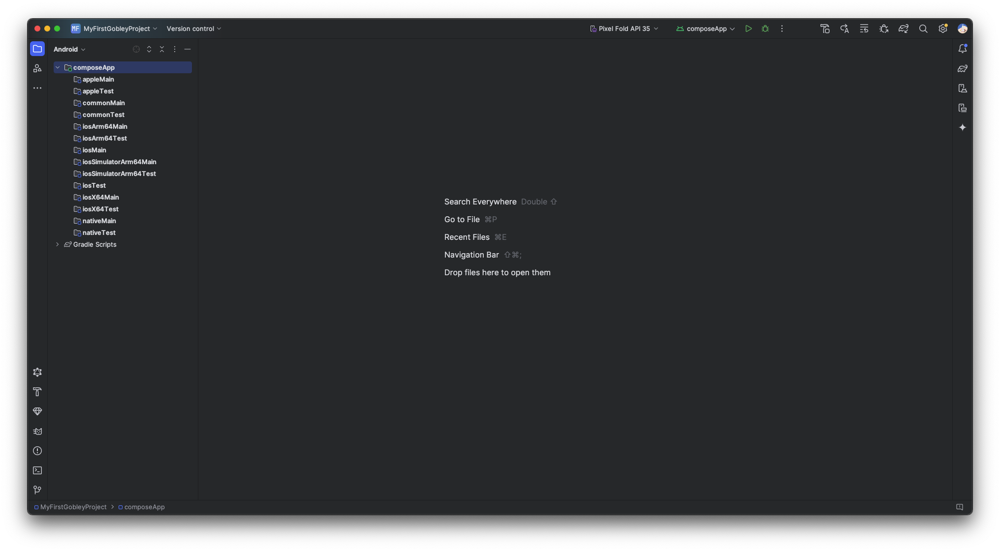
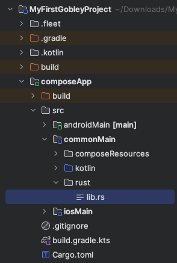
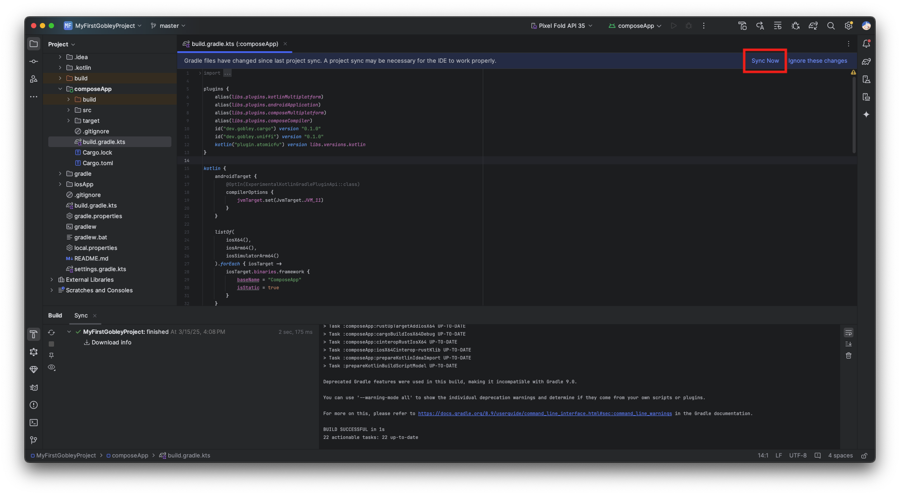
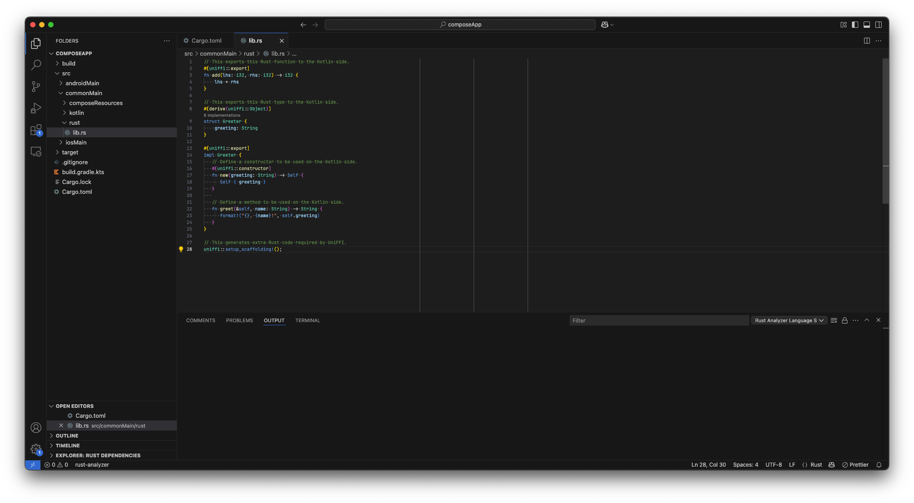
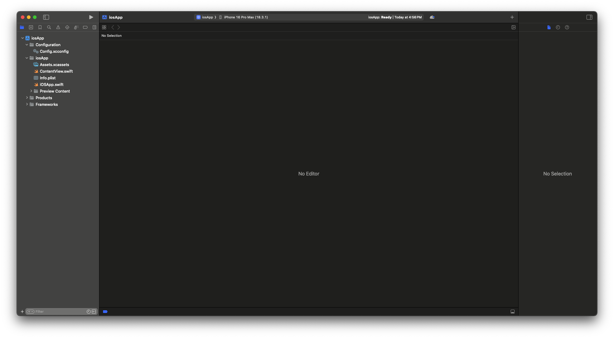
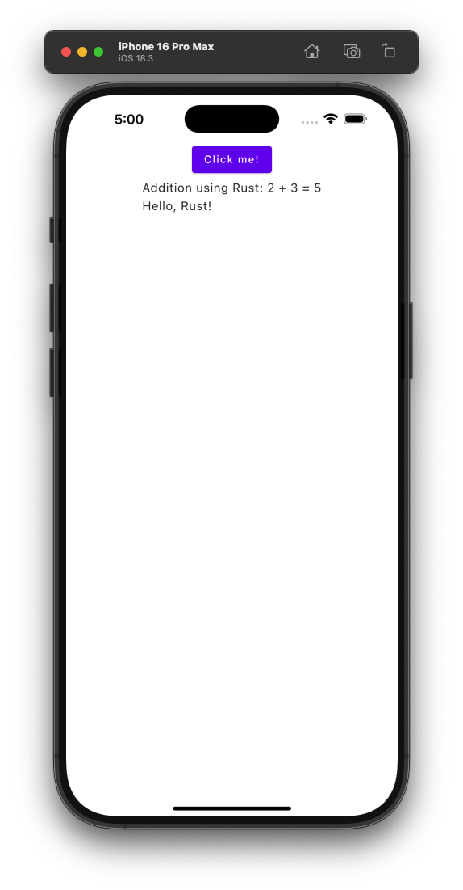

# Getting started

Welcome to Gobley! Gobley is a set of libraries and tools that help you mix Rust and Kotlin, so you
can focus on implementing your business logic. In this tutorial, you will learn how to embed Rust
code into your Kotlin Multiplatform project using Gobley. If you have trouble setting up your
project, please create a question
in [GitHub Discussions](https://github.com/gobley/gobley/discussions).

## Prerequisites

To develop with Kotlin Multiplatform, you need:

1. An IDE for Android development, such as [Android Studio](https://developer.android.com/studio)
   or [IntelliJ IDEA](https://www.jetbrains.com/idea/download).
2. (Optional) The IDE for iOS development: [Xcode](https://developer.apple.com/xcode).

You'll spend much time with Android Studio or IntelliJ IDEA to code in Kotlin. Xcode is required to
build iOS apps.

To develop in Rust, you need:

1. A [Rust toolchain](https://www.rust-lang.org/tools/install).
2. An IDE for Rust. Several options are available:
    - [Visual Studio Code](https://code.visualstudio.com/) with [
      `rust-analyzer`](https://marketplace.visualstudio.com/items?itemName=rust-lang.rust-analyzer).
    - [RustRover](https://www.jetbrains.com/rust).
    - [IntelliJ IDEA **Ultimate**](https://www.jetbrains.com/idea/download) with
      the [Rust plugin](https://www.jetbrains.com/help/idea/rust-plugin.html).
    - Other editors like Vim. Still, using `rust-analyzer` is recommended.

You'll use a separate IDE for Rust development. The only way to use a single IDE is IntelliJ IDEA
Ultimate, but it needs a paid subscription.

## Creating a Kotlin Multiplatform project

Let's first create a new Kotlin Multiplatform project. Please read
the [official documentation](https://www.jetbrains.com/help/kotlin-multiplatform-dev/multiplatform-create-first-app.html)
for more details about how Kotlin Multiplatform works.

1. Visit the [Kotlin Multiplatform Wizard](https://kmp.jetbrains.com) website.
2. On the **New Project** tab, set the **Project Name** and **Project ID** to names you want. Let's
   use `MyFirstGobleyProject` and `dev.gobley.myfirstproject`.
3. Make sure you selected **Android** and **iOS**.
4. Select **Share UI (with Compose Multiplatform UI framework)**. You can use Gobley without Compose
   Multiplatform, but let's focus on how to mix Rust and Kotlin this time.
5. Click the **Download** button and extract the downloaded `.zip` file.
6. Launch Android Studio or IntelliJ IDEA, and open the extracted folder.



## Adding Rust to your Kotlin Multiplatform project

Let's add a Cargo package to the Kotlin Multiplatform project.

1. Make sure you installed `cargo` and `rustup`.
2. Open the **Terminal** menu in Android Studio or IntelliJ IDEA. Run:

   ```shell
   cargo init --lib --name compose-app --vcs none composeApp
   ```

   Let's see what this command does:

    - `cargo init` will create a new Cargo package in `composeApp`.
    - `--lib` means that Cargo will create a **library** crate.
    - `--name compose-app` means that the name of the resulting Cargo package will be `compose-app`.
      Cargo doesn't like camelCase.
    - `--vcs none` means you don't want to generate `.git` or `.gitignore`.
    - `composeApp` is the directory where we'll code both in Rust and Kotlin.

   After running this command, the following files should be generated:

    - `composeApp/Cargo.toml`: This file contains the definition of the Cargo package.
    - `composeApp/src/lib.rs`: The Rust source code file.

3. Add `**/target/` to `.gitignore`.

   > :bulb: This is the folder where Cargo stores the build intermediate files and the final Rust
   > library.

4. (Optional) Move `composeApp/src/lib.rs` to `composeApp/src/commonMain/rust/lib.rs`.

   

   > :bulb: When you use CMake in an Android project, C++ source files are usually located in
   > `src/main/cpp`. This procedure imitates that behavior. It feels more organized, isn't it?

5. Modify `composeApp/Cargo.toml` like the following.

   ```toml
   # This part is already added by cargo init.
   [package]
   name = "compose-app"
   version = "0.1.0"
   edition = "2024"

   [dependencies]
   # We need to add this.
   uniffi = "0.28.3"

   # This as well.
   [lib]
   crate-type = ["cdylib", "staticlib"]
   # Put this only if you moved lib.rs.
   path = "src/commonMain/rust/lib.rs"
   ```

   Let's see what each part of the modification does:

    - `uniffi = "0.28.3"` downloads UniFFI, the library used to generate the Kotlin code (the "
      bindings") that calls the Rust library.
    - `crate-type = ["cdylib", "staticlib"]` will make Cargo generate a `.a` (static library) file
      and a `.so`/`.dylib` (dynamic library) file that can be used by Gobley. Gobley uses the static
      library file when building for iOS, and the dynamic library file for Android.
    - `path = "src/commonMain/rust/lib.rs"` designates the path to the Rust source code.

6. Add an empty file, `composeApp/uniffi.toml`.

   > :bulb: You can configure various binding generation options here.

7. Modify `composeApp/build.gradle.kts` like the following.

   ```kotlin
   plugins {
       // Other plugins here
       id("dev.gobley.cargo") version "0.1.0"
       id("dev.gobley.uniffi") version "0.1.0"
       kotlin("plugin.atomicfu") version libs.versions.kotlin
   }

   uniffi {
       generateFromLibrary()
   }
   ```

   > :exclamation: Consider managing plugin dependencies using
   > [version catalogs](https://docs.gradle.org/current/userguide/version_catalogs.html).
   >
   > :bulb: All Gradle plugins in Gobley are published in `mavenCentral()`.

   Let's see what each plugin does:

    - `dev.gobley.cargo` builds and links the Rust library to the Kotlin application.
    - `dev.gobley.uniffi` generates the bindings using UniFFI. The `uniffi {}` block is to configure
      binding generation options. Since we used `generateFromLibrary()` this time, the bindings will
      be generated automatically from the Rust library.
    - `org.jetbrains.kotlin.plugin.atomicfu` is to use atomic types used by the bindings.

We're now ready to code both in Rust and Kotlin! Press the **Sync Now** button to make the IDE
download the Gradle plugins.



## Defining and exposing Rust types and functions

Now is the time to code in Rust. Open `composeApp` in Visual Studio Code. Once `rust-analyzer` is
ready, you can see highlightings and inlay hints in the code editor. Modify
`src/commonMain/rust/lib.rs` as follows.

```rust
/// This exports this Rust function to the Kotlin side.
#[uniffi::export]
fn add(lhs: i32, rhs: i32) -> i32 {
    lhs + rhs
}

/// This exports this Rust type to the Kotlin side.
#[derive(uniffi::Object)]
struct Greeter {
    greeting: String
}

#[uniffi::export]
impl Greeter {
   /// Define a constructor to be used on the Kotlin side.
   #[uniffi::constructor]
   fn new(greeting: String) -> Self {
      Self { greeting }
   }

   /// Define a method to be used on the Kotlin side.
   fn greet(&self, name: String) -> String {
      format!("{}, {name}!", self.greeting)
   }
}

// This generates extra Rust code required by UniFFI.
uniffi::setup_scaffolding!();
```



By just applying `#[uniffi::export]` or similar macros, the functions and the types become available
on the Kotlin side. Go back to Android Studio and run **Build > Make Project**. Cargo will start
building the Rust library inside Android Studio. After the build completes, open
`composeApp/src/commonMain/dev/gobley/myfirstproject/App.kt`. Add the following lines to the part
you prefer:

```kotlin
Column {
    Text("Addition using Rust: 2 + 3 = ${uniffi.compose_app.add(2, 3)}")
    val greeting = remember { uniffi.compose_app.Greeter("Hello") }
    Text(greeting.greet("Rust"))
    DisposableEffect(greeting) {
        onDispose {
            greeting.close()
        }
    }
}
```

`Greeter` and `add` exported on the Rust side are accessible on the Kotlin side! Doc-comments are
also available, so you don't have to write the same description twice.

Let's run the Android app. Hit the Run button on the upper right corner of the screen. You can see
the Rust library is included in the final app automatically, and the app communicates with the Rust
part without any issues.

Let's run the iOS app as well. Open `iosApp/iosApp.xcodeproj` in Xcode. Run:

```shell
open -a "Xcode" ./iosApp/iosApp.xcodeproj
```



Since the part connecting Swift and Kotlin is handled by the Kotlin Multiplatform Wizard, we can
just hit the Run button as well on Xcode.

| Android                                                            | iOS                                                             |
|--------------------------------------------------------------------|-----------------------------------------------------------------|
|  |  |

## Next step

And that's how you embed Rust into your Kotlin project. If you need more detailed information about
Gobley, please read the [documentation](../docs/docs.md).