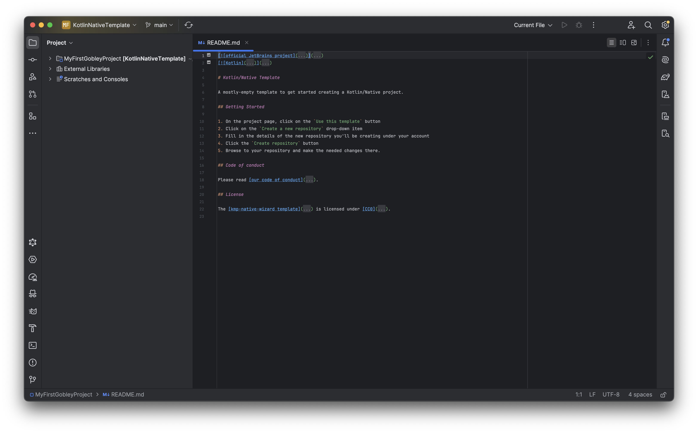
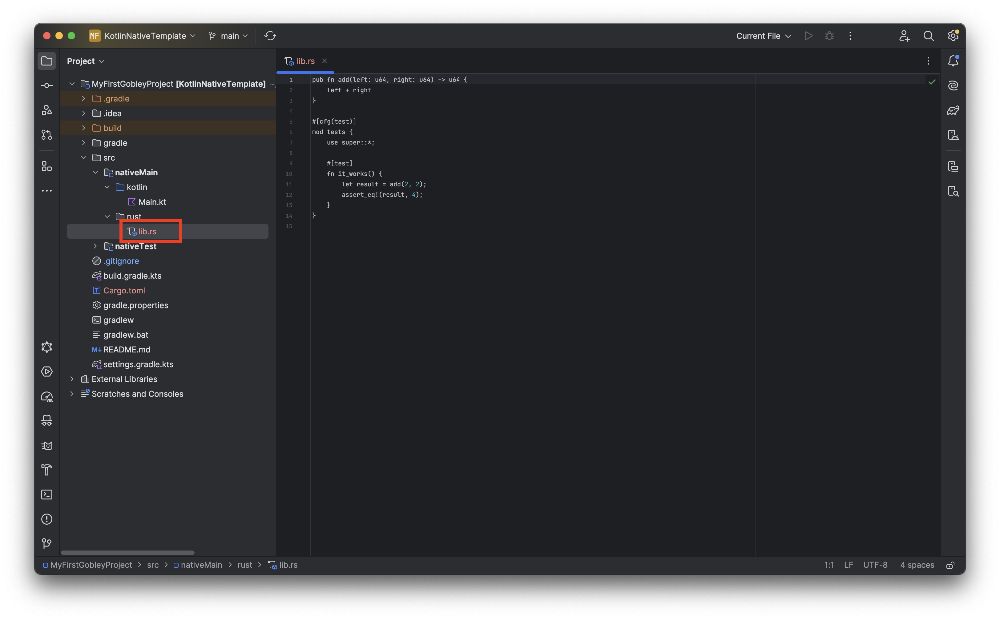
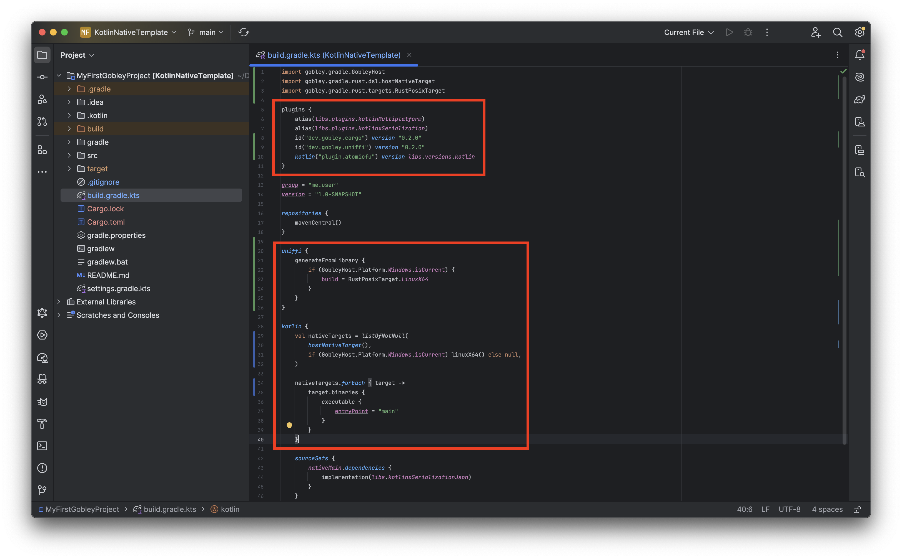
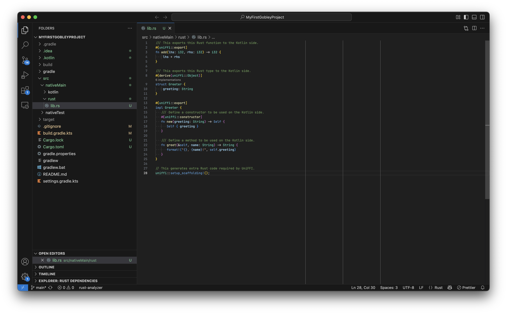
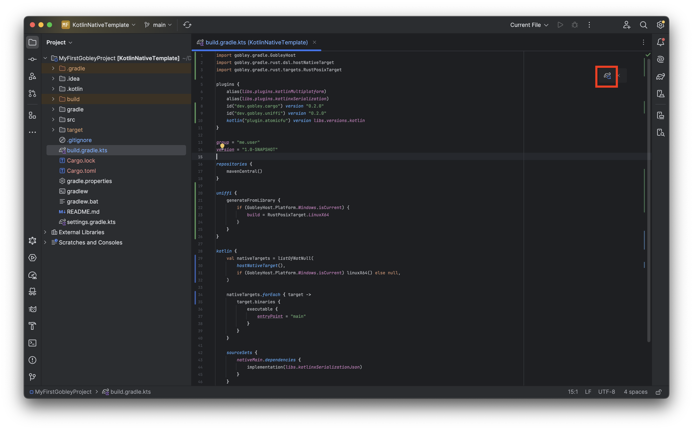
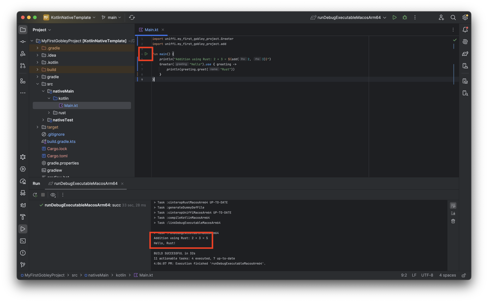

# Getting started (Native)

Welcome to Gobley! Gobley is a set of libraries and tools that help you mix Rust and Kotlin, so you
can focus on implementing your business logic. In this tutorial, you will learn how to embed Rust
code into your Kotlin/Native project using Gobley. If you have trouble setting up your project,
please create a question in [GitHub Discussions](https://github.com/gobley/gobley/discussions).

## Prerequisites

To develop an Kotlin/JVM program, you need to
install [IntelliJ IDEA](https://www.jetbrains.com/idea/download).
Using [Android Studio](https://developer.android.com/studio) is also available for Kotlin
development.

To develop in Rust, you need:

1. A [Rust toolchain](https://www.rust-lang.org/tools/install).
2. An IDE for Rust. Several options are available:
    - [Visual Studio Code](https://code.visualstudio.com/) with [
      `rust-analyzer`](https://marketplace.visualstudio.com/items?itemName=rust-lang.rust-analyzer).
    - [RustRover](https://www.jetbrains.com/rust).
    - [IntelliJ IDEA **Ultimate**](https://www.jetbrains.com/idea/download) with
      the [Rust plugin](https://www.jetbrains.com/help/idea/rust-plugin.html).
    - Other editors like Vim. Still, using `rust-analyzer` is recommended.

## Creating a Kotlin/Native project

Let's first create a new Kotlin/Native project.

1. Open IntelliJ IDEA.
2. Select **File > New > Project from Version Control**.
3. In the URL field, enter `https://github.com/Kotlin/kmp-native-wizard`.
4. Change the directory name to `MyFirstGobleyProject` and click **Clone**.



## Adding Rust to your Kotlin/Native project

Let's add a Cargo package to the Kotlin/JVM project.

1. Make sure you installed `cargo` and `rustup`.
2. Open the **Terminal** menu in IntelliJ IDEA. Run:

   ```shell
   cargo init --lib --name my-first-gobley-project --vcs none .
   ```

   Let's see what this command does:

    - `cargo init` will create a new Cargo package in `.` (the current directory).
    - `--lib` means that Cargo will create a **library** crate.
    - `--name my-first-gobley-project` means that the name of the resulting Cargo package will be
      `my-first-gobley-project`. Cargo doesn't like camelCase.
    - `--vcs none` means you don't want to generate `.git` or `.gitignore`.
    - `.` is the directory where we'll code both in Rust and Kotlin.

   After running this command, the following files should be generated:

    - `Cargo.toml`: This file contains the definition of the Cargo package.
    - `src/lib.rs`: The Rust source code file.

3. Add `/target` to `.gitignore`.

   > :bulb: This is the folder where Cargo stores the build intermediate files and the final Rust
   > library.

4. (Optional) Move `src/lib.rs` to `src/nativeMain/rust/lib.rs`.

   

   > :bulb: When you use CMake in an Android project, C++ source files are usually located in
   > `src/main/cpp`. This procedure imitates that behavior. It feels more organized, isn't it?

5. Modify `Cargo.toml` like the following.

   ```toml
   # This part is already added by cargo init.
   [package]
   name = "my-first-gobley-project"
   version = "0.1.0"
   edition = "2024"

   [dependencies]
   # We need to add this.
   uniffi = "0.28.3"

   # This as well.
   [lib]
   crate-type = ["staticlib"]
   # Put this only if you moved lib.rs.
   path = "src/nativeMain/rust/lib.rs"
   ```

   Let's see what each part of the modification does:

    - `uniffi = "0.28.3"` downloads UniFFI, the library used to generate the Kotlin code (the "
      bindings") that calls the Rust library.
    - `crate-type = ["staticlib"]` will make Cargo generate a `.lib` (Windows) or a `.a` (macOS &
      Linux) file that can be used by Gobley.
    - `path = "src/nativeMain/rust/lib.rs"` designates the path to the Rust source code.

6. Add the required Gradle plugins to `build.gradle.kts` as shown below.

   ```kotlin
   plugins {
       // Other plugins here
       id("dev.gobley.cargo") version "0.2.0"
       id("dev.gobley.uniffi") version "0.2.0"
       kotlin("plugin.atomicfu") version libs.versions.kotlin
   }
   ```

   > :exclamation: Consider managing plugin dependencies using
   > [version catalogs](https://docs.gradle.org/current/userguide/version_catalogs.html).
   >
   > :bulb: All Gradle plugins in Gobley are published in `mavenCentral()`.

   Let's see what each plugin does:

    - `dev.gobley.cargo` builds and links the Rust library to the Kotlin application.
    - `dev.gobley.uniffi` generates the bindings using UniFFI. You can change the package name of
      the bindings inside the `uniffi {}` block.
    - `org.jetbrains.kotlin.plugin.atomicfu` is to use atomic types used by the bindings.

7. (Windows only) Modify `build.gradle.kts` as follows.

   > :warning: Due to a limitation in UniFFI versions 0.28.3 and earlier regarding COFF support,
   > UniFFI cannot read Windows static libraries, regardless of whether you're using Visual C++
   > or MinGW. A fix for this
   > issue ([mozilla/uniffi-rs#2500](https://github.com/mozilla/uniffi-rs/pull/2500)) was introduced
   > in UniFFI 0.29.2. This version of UniFFI will be supported in Gobley 0.3.

   This configuration directs Gobley to use the Linux binary as input for UniFFI. Note that building
   for Linux on Windows requires additional toolchain setup. For detailed instructions, please refer
   to [Linux cross-compilation on Windows or macOS](../docs/4-cross-compilation-tips.md#linux-cross-compilation-on-windows-or-macos).

   ```kotlin
   import gobley.gradle.GobleyHost
   import gobley.gradle.rust.dsl.hostNativeTarget
   import gobley.gradle.rust.targets.RustPosixTarget

   // Plugins here
   
   uniffi {
       generateFromLibrary {
           // Make UniFFI generate bindings using the Linux X64 build on Windows
           if (GobleyHost.Platform.Windows.isCurrent) {
               build = RustPosixTarget.LinuxX64
           }
       }
   }
   
   kotlin {
       // Comment out the original code
       // val hostOs = System.getProperty("os.name")
       // val isArm64 = System.getProperty("os.arch") == "aarch64"
       // val isMingwX64 = hostOs.startsWith("Windows")
       // val nativeTarget = when {
       //     hostOs == "Mac OS X" && isArm64 -> macosArm64("native")
       //     hostOs == "Mac OS X" && !isArm64 -> macosX64("native")
       //     hostOs == "Linux" && isArm64 -> linuxArm64("native")
       //     hostOs == "Linux" && !isArm64 -> linuxX64("native")
       //     isMingwX64 -> mingwX64("native")
       //     else -> throw GradleException("Host OS is not supported in Kotlin/Native.")
       // }

       val nativeTargets = listOfNotNull(
           // hostNativeTarget("native") is equivalent to the above
           hostNativeTarget(),
           // Build for Linux as well on Windows
           if (GobleyHost.Platform.Windows.isCurrent) linuxX64() else null,
       )

       nativeTargets.forEach { target ->
           target.binaries {
               executable {
                   entryPoint = "main"
               }
           }
       }
   
       // Other settings here 
   }
   ```

We're now ready to code both in Rust and Kotlin!

> :question: If you hit the **Sync Now** button at this point, you'll get a
> `Crate compose_app not found in libcompose_app.a` error. That's because you haven't used
> `uniffi::setup_scaffolding!();` inside the Rust code. If you encountered such an error, go
> straight to the next step.



## Defining and exposing Rust types and functions

Now is the time to code in Rust. Open the project folder in Visual Studio Code.

```shell
code .
# or on macOS
open -a "Visual Studio Code" .
```

Once `rust-analyzer` is ready, you can see highlightings and inlay hints in the code editor. Modify
`src/nativeMain/rust/lib.rs` as follows.

```rust
/// This exports this Rust function to the Kotlin side.
#[uniffi::export]
fn add(lhs: i32, rhs: i32) -> i32 {
    lhs + rhs
}

/// This exports this Rust type to the Kotlin side.
#[derive(uniffi::Object)]
struct Greeter {
    greeting: String
}

#[uniffi::export]
impl Greeter {
   /// Define a constructor to be used on the Kotlin side.
   #[uniffi::constructor]
   fn new(greeting: String) -> Self {
      Self { greeting }
   }

   /// Define a method to be used on the Kotlin side.
   fn greet(&self, name: String) -> String {
      format!("{}, {name}!", self.greeting)
   }
}

// This generates extra Rust code required by UniFFI.
uniffi::setup_scaffolding!();
```



By just applying `#[uniffi::export]` or similar macros, the functions and the types become available
on the Kotlin side. Go back to IntelliJ IDEA and press the **Sync Gradle Changes** button.



Cargo will start building the Rust library inside IntelliJ IDEA. After the build completes, modify
`src/nativeMain/kotlin/Main.kt` as follows.

```kotlin
import uniffi.my_first_gobley_project.Greeter
import uniffi.my_first_gobley_project.add

fun main() {
    println("Addition using Rust: 2 + 3 = ${add(2, 3)}")
    Greeter("Hello").use { greeting ->
        println(greeting.greet("Rust"))
    }
}
```

`Greeter` and `add` exported on the Rust side are accessible on the Kotlin side! Doc-comments are
also available, so you don't have to write the same description twice.

Let's run the program. Hit the Run button next to the `main()` function. You can see the program
communicates with Rust without any issues.



## Next step

And that's how you embed Rust into your Kotlin project. If you need more detailed information about
Gobley, please read the [documentation](../docs/0-overview.md).